<p style="font-size: xxx-large">Developer Guide</p>

<ul>
    <li><strong><a href="#acknowledgements">Acknowledgements</a></strong></li>
    <li><strong><a href="#setting-up">Setting Up, Getting Started</a></strong></li>
    <li><strong><a href="#design">Design</a></strong>
    <ul>
        <li><a href="#architecture">Architecture</a></li>
        <li><a href ="#main components">Main Components</a></li>
        <ul>
            <li><a href="#parser-component">Parser Component</a></li>
            <li><a href="#newsArticle-model">NewsArticle and Topic Model</a></li>
            <li><a href="#ui-component">UI Component</a></li>
            <li><a href="#command-classes">Command Classes</a></li>
            <li><a href="#news-importer">NewsImporter</a></li>
            <li><a href="#storage-classes">Storage Classes</a></li>
        </ul>
    </ul>
</ul> 
<li><strong><a href="#interaction-between-components">Interaction between Components</a></strong></li>
<li><strong><a href = "#main-object-classes">Main Object Classes</a></strong></li>
<li><strong><a href="#implementation">Implementation</a></strong></li>
    <ul>
        <li><a href="#daily">Daily Feature</a></li>
        <ul>
            <li><a href="#daily-implementation">Implementation</a></li>
            <li><a href="#daily-design">Design Consideration</a></li>
        </ul>
    </ul>
    <ul>
        <li><a href="#filter-news-by-topic"> Filter News by Topic Feature</a></li>
        <ul>
            <li><a href="#topics">Topics Feature</a></li>
            <ul>
                <li><a href="#topics-implementation"> Implementation </a></li>
                <li><a href="#topics-filter-design">Design Consideration</a></li>
            </ul>
        </ul>
        <ul>
            <li><a href="#filter">Filter Feature</a></li>
            <ul>
                <li><a href="#filter-implementation">Implementation</a></li>
                <li><a href="#topics-filter-design">Design Consideration</a></li>
            </ul>
        </ul>
        <ul>
            <li><a href="#suggest">Suggest Feature</a></li>
            <ul>
                <li><a href="#suggest-implementation">Implementation</a></li>
                <li><a href="#suggest-design">Design Consideration</a></li>
            </ul>
        </ul>
      <li><a href="#url">URL Feature</a></li>
      <ul>
          <li><a href="#url-implementation">Implementation</a></li>
          <li><a href="#url-design">Design Consideration</a></li>
      </ul>
      <li><a href="#headlines">Headlines Feature</a></li>
      <ul>
          <li><a href="#headlines-implementation">Implementation</a></li>
          <li><a href="#headlines-design">Design Consideration</a></li>
      </ul>
      <li><a href="#load">Load Feature</a></li>
      <ul>
          <li><a href="#load-implementation">Implementation</a></li>
          <li><a href="#load-design">Design Consideration</a></li>
      </ul>
      <li><a href="#extract">Extract Feature</a></li>
      <ul>
          <li><a href="#load-implementation">Implementation</a></li>
          <li><a href="#load-design">Design Consideration</a></li>
      </ul> 
    <li><a href="#product-scope">Appendix A: Product Scope</a></li>
        <ul>
            <li><a href = "#target-user-profile">Target User Profile</a></li>
            <li><a href = "#value-proposition">Value Proposition</a></li>
        </ul>
    <li><a href="#user-stories">Appendix B: User Stories</a></li>
    <li><a href="#non-functional-requirements">Appendix C: Non-Functional Requirements</a></li>
    <li><a href="#glossary">Appendix D: Glossary</a></li>
    <li><a href="#manual-testing"> Appendix E: Instructions for manual testing </a></li>
</ul>

<br>

<h2 id="acknowledgements"> Acknowledgements </h2>
<ul>
    <li>
        <p>
            Referenced to 
            <a href="https://se-education.org/addressbook-level3/DeveloperGuide.html">
                AB-3 Developer Guide
            </a>
        </p>
    </li>
    <li>
        <p>
            Use of 
            <a href="https://jsoup.org/">
                jsoup library
            </a>
            to scrap articles
        </p>
    </li>
</ul>

<br>

<h2 id="setting-up"> Setting up, Getting Started</h2>
First, fork this repo, and clone the fork into your computer.

If you plan to use Intellij IDEA (highly recommended):

<ol>
    <li>
        Configure the JDK: Follow the guide 
        <a href="https://se-education.org/guides/tutorials/intellijImportGradleProject.html">
            [se-edu/guides] IDEA: Configuring the JDK 
        </a>
        to to ensure Intellij is configured to use JDK 11.</li>
    <li>
        Import the project as a Gradle project: Follow the guide
        <a href="https://se-education.org/guides/tutorials/intellijImportGradleProject.html">
            [se-edu/guides] IDEA: Importing a Gradle project 
        </a>
        to import the project into IDEA.
    </li>
<span style="color: red"> &#33; </span> Note: Importing a Gradle project is slightly different from importing a normal Java project.
    <li>
    Verify the setup:
    <ol>
        <li>
            Run NewsOnTheGo and try a few commands from our 
            <a href="UserGuide.md"> User Guide.</a>
        </li>
    </ol>
    </li>
</ol>


Alternatively, refer to our <a href="UserGuide.md">User Guide</a> for quick start details.


<h2 id="design"> Design </h2>

<h3 id = "architecture"> Architecture </h3>

News On The Go implements a modular architecture approach with the main system broken down into smaller, 
object-oriented components. Each module encapsulated different functions that are key for the product to work smoothly.

<br>

<h4 id = "main components"> Main Components </h4>

The `main()` function is run in our main class, `NewsOnTheGo`:

  - At app launch: Initialises the components in the correct sequence, connects them up with each other.
  - At shut down: shut down components and ensure relevant data is stored for future usage.

The following components make up the application:
- <a href="#UI-component"><b>UI</b></a>: Located in the `newsonthego.utilities` package, handles communication with the user, focuses 
on retrieving input to initialise the system as well as to print out various messages to the user. 
- <a href="#Parser-component"><b>Parser<b></a>: In charge of making sense of the user input, parsing user inputs into commands to be
executed.
- <a href="#Command-Classes"><b>Commands</b></a>: `commands` represent a collection of classes that are invoked based on various user 
commands. 
- <b>Storage</b>: Can be segmented into various parts based on their function:
  - <a href="#NewsImporter-and-ArticleScraper">Article Scraper and News Importer</a>: Gets relevant information from the web based 
  on urls provided on initialisation to generate a list of articles for the user. 
  - <a href = "newsfile-and-storage">News Storage</a>: For storage of articles that the user chooses to save when the application
  is running.
  - Topics Storage: Stores the list of topics that the user has starred for future usage.

<h4 id="parser-component"> Parser Component </h4>
The parser component is responsible for interpreting user commands and invoking the correct command methods in the logic component.

- **Parsing Commands**: The method `handleCommand` starts by attempting to convert the user input string into a `Command` enumeration. If the command does not match any predefined commands, it defaults to `VOID`.

- **Command Handling**: Depending on the recognized command, `handleCommand` uses a switch-case structure to handle each possible command. Each case block calls the corresponding method or class that implements the command's functionality.

- **Contextual Command Execution**: Some commands, like `GET`, `SAVE`, or `EXTRACT` require checking if a filtering context is set (i.e., `topic` variable). If a topic is currently selected (not **\-1**), the command is applied within the context of that topic.

- **Quote Generation**: In the case of the `QUOTE` command, it creates an instance of `QuoteGenerator` and retrieves a random quote.


<h4 id="newsArticle-model"> News Article and Topic Models </h4>

The `NewsArticle` class encapsulates data for each news article, including attributes such as headline, date, author, and content. The `NewsTopic` class represents categories that articles can be classified under, which enables the user to filter and organize news based on interested topics

<br>

<h4 id="ui-component"> UI Component </h4>

The UI class in is responsible for all command line interactions, displaying welcome and goodbye messages, providing structured command formats, and handling the output of news content and errors. It uses methods like `printMessage` and `printConfused` to ensure clear and correct text output.


<h3 id="command-classes"> Command Classes</h3>

*   **DailyNewsCommand**: This class deals with fetching and displaying news articles based on a specific date input by the user. It filters the overall list of articles to those that match the given date.

*   **FilterNewsCommand**: Provides the functionality to filter news articles based on a particular topic. When a topic is given, it compiles a list of articles related to that topic for the user.

*   **GetNewsSourceCommand**: The command class responsible for fetching the news source of a particular article. When an article index is provided, it retrieves and displays the source information.

*   **QuoteGenerator**: This class is not directly related to news articles but provides an auxiliary feature that offers a random inspirational quote to the user, possibly to enhance user engagement.

*   **ShowExtractCommand**: Handles the display of a brief summary or extract from a specific news article. It is useful for users who want a quick insight into an article's content.

*   **ShowHeadlinesCommand**: This command class is designed to display the headlines of a list of articles up to a specified index, giving users a quick overview of the news.

*   **URLCommand**: The purpose of this class is to provide the URLs of news articles. It can give the URL for a single article when provided with an index or list the URLs for a set of articles, such as those filtered by the **DailyNewsCommand**.

<h3 id="news-importer"> NewsImporter </h3>

*   The **NewsImporter** class imports news data from a text file into the application. 

*   **Functionality**: The `importNewsFromText()` method takes a filename and a list of news topics as parameters, attempting to read a file line-by-line to extract news article data and convert it into **NewsArticle** objects.

*   **Data Parsing**: Each line from the file is split into components using a semicolon delimiter, extracting various attributes such as headlines, author names, publication dates, sources, URLs, and content for each article.

*   **Topic Association**: As it creates **NewsArticle** objects, the method also checks against existing topics to either append the article to an existing topic or create a new **NewsTopic** if the article's topic doesn't exist in the current list

<h3 id="storage-classes"> Storage Classes</h3>

*   **NewsFile**: Manages the saving and retrieving of news articles to and from persistent storage, typically a text file. It enables users to maintain a list of articles they wish to keep for future reference.

*   **StorageURL**: Contains a list of URLs from which news articles can be fetched. It is a central component for the article scraping feature of the application, maintaining the sources from which the latest news is retrieved.

<br>


<h3 id = "interaction-between-components"> Interaction between Components </h3>

The _Sequence Diagram_ below shows how the components interact with each other for the scenario where the user issues the command `clear`.

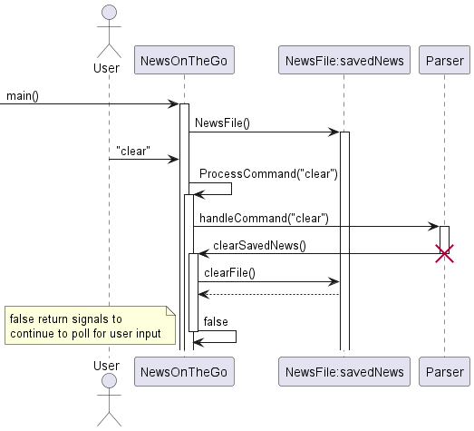

<h3 id = "main-object-classes"> Main Object Classes </h3>

_There are two main object-oriented classes that are used in the application:_
- `NewsArticle`: Each instance stores a News Article and their related information.
- `NewsTopic`: Each instance stores a News Topic and their relevant articles.

The diagram below shows how these classes are associated to the main class `NewsOnTheGo`:


<h2 id="implementation"> Implementation</h2>

This section describes noteworthy details regarding the design and implementation of the product.

<h3 id="article-scrapper"> Article Scraper</h3>

The `ArticleScraper` class is designed to scrape information from web articles given their URLs. It utilizes the Jsoup
library for web scraping. 

Here's a breakdown of its key functionalities:

<h4> Scrape Articles Functionality: </h4>

`scrapeArticles(String inputFilePath, String outputFolderPath)`: 

Reads a list of article URLs from a text file specified 
by `inputFilePath` and scrapes each article using the `scrapeArticle` method.

<h4 id=""> Web Scraping Logic 1: </h4>

`extractTheme(Document doc)`: 

Attempts to extract the theme of the article from its metadata using various formats such 
as Open Graph metadata, "categories" metadata, "theme" metadata, or "article:section" metadata.

<h4 id=""> Web Scraping Logic 2: </h4>

`extractPublishedDate(Document doc)`: 

Tries to extract the published date of the article using different metadata formats
like "article:published_time" or "cXenseParse:recs:publishtime".

<h4> Web Scraping Logic 3: </h4>

`extractAuthor(Document doc)`: 

Extracts the author's name from the article metadata using the "cXenseParse:author" 
metadata tag.

<h4> File Handling: </h4>

Uses Java's file handling classes (`BufferedReader`, `BufferedWriter`, `FileReader`, `FileWriter`) to 
read input URLs from a text file and write scraped data to an output text file.

<h4> Dependency: </h4>

Relies on the [Jsoup](https://jsoup.org/) library (`org.jsoup.Jsoup`) for web scraping functionalities, 
specifically for parsing HTML and extracting data elements.

<h4> Implementation </h4>

1. NewsOnTheGo: Initiates the process by checking the existence and content of the `testArticleScraper.txt` file.

2. NewsOnTheGo: If the file does not exist or is empty, an instance of the `StorageURL` class is created.

3. NewsOnTheGo: Calls the `getURLs()` method on the `StorageURL` instance to obtain a list of URLs.

4. NewsOnTheGo: Creates an instance of the `ArticleScraper` class.

5. NewsOnTheGo: Loops through each URL in the list obtained from `StorageURL`.

6. NewsOnTheGo: For each URL, it calls the `scrapeArticle()` method on the `ArticleScraper` instance.

7. ArticleScraper: Scrapes the article from the provided URL.

8. NewsOnTheGo: Handles the scraped data by saving to `testArticleScraper.txt`.

9. NewsOnTheGo: Continues the loop for each URL, calling the `scrapeArticle()` method until all URLs have been processed.

10. NewsOnTheGo: Once all URLs have been processed, closes the `testArticleScraper.txt` file.


The flow can be seen from the sequence diagram below: 

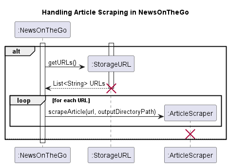

Within the `ArticleScraper` class itself, the flow can be seen from this second diagram below:

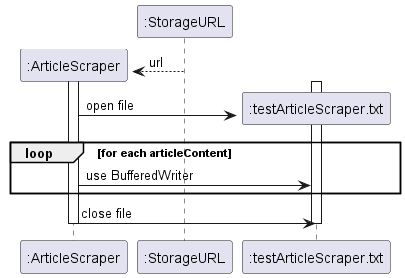

This is an overall class diagram for better visualisation of how the classes interact:

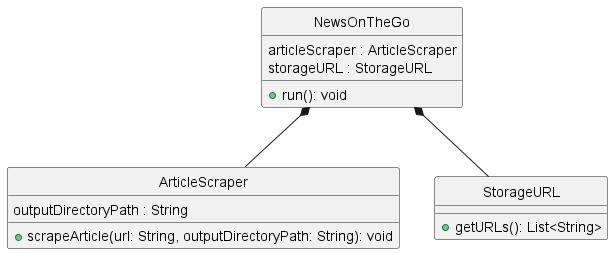

<h3 id="daily"> Daily Feature </h3>


<h4 id="daily-implementation"> Implementation </h4>

This daily mechanism is facilitated by a constructor from the `DailyNewsCommand` class. It takes in an input from 
the user and the current list of articles to display the news on published on a particular day to the user.  
This feature also implements the following operations:  

- `DailyNewsCommand#save()` — Saves a news article from the list given to their reading list
- `DailyNewsCommand#back()` — Exits the daily feature loop.

Given below is an example usage of the daily mechanism behaves at each step.

Step 1: The user launches the application. This initialises a list of news articles named `newsArticles` by reading
from a text file.

Step 2: When the user executes the `daily 10 March 2024` to find news articles on that day. The `DailyNewsCommand`
constructor is called, which searches the `newsArticles` list to find the corresponding news articles. The list of 
articles found are collected into a list `articlesOfTheDay`, which will be output to the user.

Step 3: After being shown the list of newsArticles, the user is able to select news article that he wants to read later
by using the `save(1)` command, which saves the first news article on the list.

Step 4: When the user is done saving the desired news articles, he is able to go back to the main function by using the
`back()` command.

The flow can be seen from the sequence diagram below.  

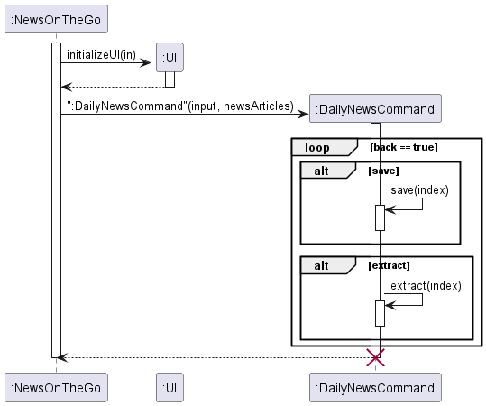

<h4 id="daily-design"> Design Considerations </h4>

Whether to put additional features in the daily class or parser function.

- **Alternative 1:** Implement in the main parser.
  - Pros: Allows other classes to use the save features.
  - Cons: Need to ensure these features do not create additional bugs.

- **Alternative 2 (current choice):** Implement in the daily class.
  - Pros: Create the function base on the needs of the daily class only, making it easier to debug too.
  - Cons: Not able to use outside the daily class.


<h3 id="filter-news-by-topic"> Filter News by Topic Feature </h3>

<h4 id="topics"> Topic Feature </h4>

<h4 id="topics-implementation"> Implementation </h4>

The `topics` function in  `NewsOnTheGo` class is used to show the list of topics linked to the current list of news 
articles. 

This mechanism makes use of the `NewsTopic` class to store each distinct News Topic as `NewsTopic` object, stored as a 
`newsTopics` ArrayList. 

The `Topic` function is complemented by the `Filter` Function which displays the list of articles related to the 
specified topic.

<h4 id="filter"> Filter Feature </h4>

<h4 id="filter-implementation"> Implementation </h4>

The `filterNews` function in `NewsOnTheGo` class is used to show the list of articles linked to a specific topic.

This mechanism makes use of the ArrayList of `relatedNewsArticles` in a `NewsTopic` object. 

This feature also implements the following operations:
- `FilterNewsCommand#save()` — Saves the list of news articles in the topic to their reading list.
- `FilterNewsCommand#get()` — gets the details of the article and displays it to the user.
- `FilterNewsCommand#source()` — displays the source of the article to the user.
- `FilterNewsCommand#extract()` — displays the extract of the article.
- `FilterNewsCommand#url()` — displays the url link of the article.
- `FilterNewsCommand#back()` — Exits the filter topic feature and returns to main article list.

Given below is an example usage scenario and how the filter and topic mechanism behaves at each step.

Step 1. The user inputs the command `TOPICS`. The `handleCommand` method will parse the input message into the command. 
The `TOPICS` command will cause `printAllTopics` in the UI class to be called, which will display the current list of 
topics of the news articles.

The following sequence diagram shows how the topic operation works. <br>

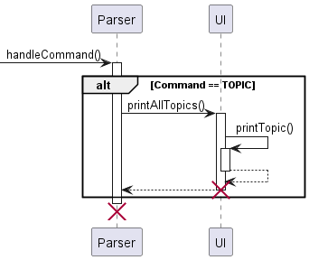

Step 2. Suppose the user wants to see news articles related to politics, the user then inputs `filter politics`. 
The `handleCommand` takes in the command and calls `filterNews` which used a binary search function `findTopicIndex` to 
search for the index of the topic in the ArrayList of `NewsTopic`, returning -1 if the topic is not valid, else the 
index of the topic in the list will be returned. the `filterNews` function will then print out the list of articles for 
the user.  

Output may look like this:
```
____________________________________________________________

What do you want from me?
____________________________________________________________

filter politics
Here are the news articles related to Politics: 
    1. "FAFSA: What?s happening with 2024 college financial aid? | CNN Politics"
    2. "Inside President Biden?s pointed phone call with Benjamin Netanyahu | CNN Politics"
    3. "Trump?s inflammatory rhetoric has been effective for him so far but poses real danger | CNN Politics"
    4. "Embittered Republicans plot to knock off House GOP?s hard-right leader in Virginia primary feud | CNN Politics"
    5. "Exclusive: Hackers stole Russian prisoner database to avenge death of Navalny | CNN Politics"
____________________________________________________________

You are currently in access to the list of articles in Politics, 
    use command 'BACK' to return to main list of articles.
____________________________________________________________
```

Step 3. If the user wants to save the 3rd article in the list displayed, they would then input `save 3`. The 
`handleCommand` in `Parser` will then check the `topicIndex` to identify the correct list to extract the 
specified article from. If `topicIndex` is -1, the article will be taken from the main list of articles. 
The `saveNews` in the `NewsFile` class will save the specified article into the text file `saved_news.txt` in 
`user_data`. 

Output may look like this:
```
What do you want from me?
____________________________________________________________

save 3

____________________________________________________________

Successfully saved "Trump?s inflammatory rhetoric has been effective for him so far but poses real danger | CNN Politics"
    find your saved articles at user_data\saved_news.txt
____________________________________________________________

```

Step 4. Other than the save function, users are able to get source of the function and its APA citation 
by using `source`. If the user wants the source of the 4th article, they would write `source 4`.  

Output may look like this:

```
What do you want from me?
____________________________________________________________

source 4
____________________________________________________________
"Embittered Republicans plot to knock off House GOP?s hard-right leader in Virginia primary feud | CNN Politics"
URL: https://edition.cnn.com/2024/03/31/politics/bob-good-primary-fight-virginia/index.html?iid=cnn_buildContentRecirc_end_recirc
By: Manu Raju    On: March 31, 2024
CNN

APA Citation: Raju, M. (2024, March 31). "Embittered Republicans plot to knock off House GOP?s hard-right leader in Virginia primary feud | CNN Politics". CNN. https://edition.cnn.com/2024/03/31/politics/bob-good-primary-fight-virginia/index.html?iid=cnn_buildContentRecirc_end_recirc
```

The following sequence diagram shows how the topics, filter and source mechanism may work in conjunction with other commands.

<br>

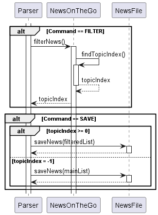

<br>
In this feature, topicIndex acts as both a flag and a source of information — it sends a flag to the parser function to 
use the filtered article list if topicIndex >= 0, and if this is the case it tells the command the index of the topic 
list to execute the command from.

> [!NOTE] The above sequence diagram will be similar for other functions that can run in conjuction with filter, such as
> `get`, `url` and `extract`. 


<h4 id="topics-filter-design"> Design Considerations </h4>

Alternative 1 (current choice): check for topicIndex in handleCommand

- Pros: easy to implement
- Con: duplicate checking of topicIndex for article commands

Alternative 2: loop in filter command

- Con: have to come up with handle commands inside the filter command loop
- Con: initialising another Scanner object may cause unexpected conflicts

<br>

<h3 id="suggest"> User Preferences (SUGGEST) Feature </h3>


Here is the class diagram for better visualisation:
<br>

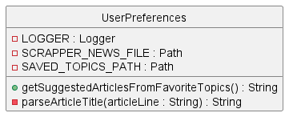


<br>

<h4 id="suggest-implementation"> Implementation </h4>

The `SUGGEST` feature provides users with article recommendations based on their favorite topics. The user's favorite
topics are stored and managed by the `UserPreferences` class, which retrieves and suggests news articles 
related to these topics.

1. When the `SUGGEST` command is invoked, `UserPreferences.getSuggestedArticlesFromFavoriteTopics()` is called.
2. This method reads the user's favorite topics from the `saved_topics.txt` file.
3. It then fetches all news articles from `testArticleScraper.txt`.
4. For each favorite topic, it filters articles related to that topic and randomly selects one to suggest to the user.

The following diagram describes the `getSuggestedArticlesFromFavoriteTopics()` method, highlighting how it 
processes user's favorite topics to suggest random articles. 

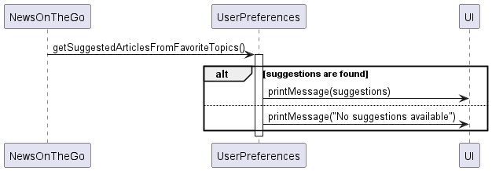

<h4 id="suggest-design"> Design Considerations </h4>

The decision to use a random selection approach was to provide a dynamic user experience. This encourages users to 
discover a variety of articles within their favourite topics.

<br>

#### Alternatives Considered

Alternative 1 (current choice): Randomly select an article from the list of articles corresponding to 
each favorite topic.

- **Pros:** Simple to implement and ensures a variety of articles are suggested to the user.
- **Cons:** A user might see the same article suggested multiple times, especially if the topic has a small set of 
related articles.


Alternative 2: Implement a more sophisticated algorithm that keeps track of previously suggested articles and ensures 
a new selection in each suggestion cycle.

- **Pros:** Ensures that users do not receive the same suggestion more than once until all available articles have 
been suggested.
- **Cons:** More complex to implement, and might require additional storage to keep track of suggestion history.


<h3 id="url"> URL Feature </h3>

Here is the class diagram for better visualisation:

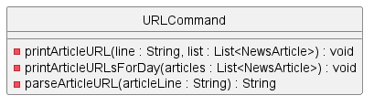

<h4 id="url-implementation"> Implementation </h4>

The **URL** feature enables users to quickly access the URL of a specific news article listed in the application. This feature is handled by the `URLCommand` class which provides the functionality to retrieve and display the URL based on an article index provided by the user.

1.  The user inputs a command in the format: `url` .

2.  `URLCommand.printArticleURL(String line, List list)` is called with the user input and the current list of articles.

3.  The method parses the command to extract the article index.

4.  If the index is valid, it retrieves the article from the provided list and prints the URL. If the index is invalid, an error message is displayed. <br>

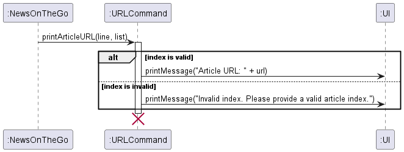

<br>

#### Additional Usage
The URL are also utilized in other functionalities of the application without explicitly using the `url` command:

1. **`Daily` News Feature**: When daily news articles are displayed, their URLs are included alongside other details for easy access.
2. **`Save` and `Load` Features**: When articles are saved to the reading list, their URLs are stored in the text file automatically and displayed when articles are loaded from this list.

Given below is an example usage scenario demonstrating the use of the URL feature through the `url`, `daily`, `save`, and `load` commands.


Step 1: The user can display headlines through by using the `headlines` command. The `handleCommand` method will parse the input and invoke the `showHeadlines` method, which will list the first five article headlines from the news articles list.

**Example Output:**
```
headlines 5

Displaying the first 5 article headlines:
1. "Kristen Wiig initiated into SNL five-timers club by Ryan Gosling, Matt Damon and Lorne Michaels | CNN"
2. "The Matrix has a fifth film in the works and, no, this is not a simulation | CNN"
3. "Dune: Part Two may be followed by a third film, but Timothee Chalamet and Zendaya dont know how it all ends | CNN"
4. "Angelina Jolie alleges history of Brad Pitts physical abuse prior to 2016 plane ride in new Miraval filing | CNN"
5. "Adrian Schiller, star of The Last Kingdom, dead at 60: Sudden and unexpected | CNN"

What do you want from me? 
```

Step 2: Suppose the user wants to access the URL of the 3rd article, they then input `url 3`. The `handleCommand` method processes this command and calls `URLCommand.printArticleURL`, which retrieves and displays the URL of the third article.

**Example Output:**
```
url 3
___________________________________________________________

Article URL: https://edition.cnn.com/2024/03/04/entertainment/dune-part-two-sequel/index.html
____________________________________________________________

What do you want from me?
____________________________
```

Step 3: On another occasion, lets say the user decides to view articles from a specific date and potentially save one for later reading. The `handleCommand` executes the `DailyNewsCommand`, displaying the articles from that specific day. The url is of the article is also output for easy access

**Example Output :**
```
daily april 07 2024

____________________________________________________________

Sure! Here are the headlines for today (April 07, 2024) :

    1: "Kristen Wiig initiated into �SNL� five-timers club by Ryan Gosling, Matt Damon and� Lorne Michaels | CNN"
    URL: https://edition.cnn.com/2024/04/07/entertainment/kristen-wiig-ryan-gosling-matt-damon-snl/index.html
```

Step 4: If the user wants to save an article, which triggers the saving of the second article displayed. The `handleCommand` recognizes whether it is a filtered list or is it the original list (use for the headline feature) and saves the specified article. The save feature will also store the url of the article and display it when the `load` command is used to view the stores articles

**Example Output :**
``` 
save 1

____________________________________________________________

Successfully saved "Kristen Wiig initiated into SNL five-timers club by Ryan Gosling, Matt Damon and Lorne Michaels | CNN"
    find your saved articles at user_data\saved_news.txt
    
load 

"Kristen Wiig initiated into ‘SNL’ five-timers club by Ryan Gosling, Matt Damon and… Lorne Michaels | CNN"
    URL: https://edition.cnn.com/2024/04/07/entertainment/kristen-wiig-ryan-gosling-matt-damon-snl/index.html
    By: Alli Rosenbloom    On: April 07, 2024
    CNN
```

<h4 id="url-design"> Design Considerations </h4>

The implementation of the URL feature is designed to be straightforward and efficient, allowing users to quickly access the web links of news articles with minimal interaction and waiting time.

*   **Direct Access**: The feature allows direct access to URLs without navigating through multiple steps, enhancing the user experience.

*   **Error Handling**: Proper error handling for invalid indices ensures the system is robust and can guide users to correct mistakes.


#### Alternatives Considered

Alternative 1 (current choice): Direct retrieval of URLs based on an index input by the user.

*   **Pros:** Immediate and simple, allowing quick access which is ideal for command-line environments.

*   **Cons:** User must know the exact index of the article, which might not always be convenient.


Alternative 2: Search for an article by keywords and then provide URL options.

*   **Pros:** More flexible as it allows users to find articles without knowing the exact index.

*   **Cons:** More complex implementation and potentially slower due to the search process.


<h3 id="headlines"> Headlines Feature </h3>

<h4 id="headlines-implementation"> Implementation </h4>

This feature allows users to quickly view the headlines of the top articles from the original scraped list. This feature is managed by the `ShowHeadlinesCommand` class, which handles displaying a specified number of article headlines based on user input.

1.  When the `headlines` command is invoked, `ShowHeadlinesCommand.showHeadlines(String line)` is called with the user's input.

2.  The method validates the command format and checks if the number of articles specified is a positive integer.

3.  It then reads the news article headlines from the **testArticleScraper.txt** file, which contains all the latest scraped news articles.

4.  The method will display the specified number of headlines, starting from the top of the list.


The following sequence diagram shows how the **showHeadlines** method processes the command to fetch and display the headlines. <br>

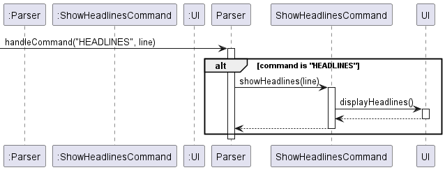

Given below is an example usage scenario for the Headlines feature:

Step 1: To view the top five headlines from the news list, the user inputs `headlines 5` . The command processes this input and displays the first five headlines from the **testArticleScraper.txt** file.

**Example Output:**

```   
What do you want from me?

headlines 5  

Displaying the first 5 article headlines:  
1. "Scientists Discover New Species of Butterfly in the Amazon"  
2. "Stock Market Surges to Record Highs Amid Economic Recovery" 
3. "Political Tensions Rise in Region X Following Border Dispute"  
4. "Breakthrough in Cancer Research Offers Hope for New Treatment"  
5. "Tech Giants Announce Partnership to Combat Online Misinformation" 
 ```

Step 2: After the headlines, if a user wants to read more about a specific article, they could use the `get` command or request the URL using the `url` command to directly access the news list, further integrating with other features of the system.

**Example Output:**
```

What do you want from me?
____________________________________________________________

get 1
___________________________________________________________

"Kristen Wiig initiated into SNL five-timers club by Ryan Gosling, Matt Damon and� Lorne Michaels | CNN"
    URL: https://edition.cnn.com/2024/04/07/entertainment/kristen-wiig-ryan-gosling-matt-damon-snl/index.html
    By: Alli Rosenbloom    On: April 07, 2024
    CNN
____________________________________________________________

What do you want from me?
____________________________________________________________

url 1
____________________________________________________________

Article URL: https://edition.cnn.com/2024/04/07/entertainment/kristen-wiig-ryan-gosling-matt-damon-snl/index.html
____________________________________________________________

What do you want from me?
```

<h4 id="headlines-design"> Design Considerations </h4>

Choosing to implement a command that fetches a specific number of headlines from the top of the list was driven by the need for quick access to the latest news without overwhelming the user with too much information at once.

#### Alternatives Considered

**Alternative 1 (current choice):** Displaying a specified number of headlines starting from the most recent.

*   **Pros:** Users get immediate access to the latest headlines, which is often the most sought-after information.

*   **Cons:** May not provide a comprehensive view if the number specified is too small.


**Alternative 2:** Implement a paging system where users can navigate through headlines in a paginated manner.

*   **Pros:** Offers a more organized way to browse through headlines, especially when the list is long.

*   **Cons:** Increases complexity of implementation and may require more input from the user to navigate through pages.


<h3 id="load"> Load Feature </h3>

<h4 id="load-implementation"> Implementation </h4>

This feature allows users to access their saved news articles from a persistent storage. Managed by the **NewsFil** class, this feature reads the news articles stored in the **saved_news.txt** file.

1.  When the user inputs the `load` command, `NewsOnTheGo.loadAndDisplaySavedNews()` is called.

2.  This method checks for the existence of the **saved\_news.txt** file and reads its contents.

3.  Each line in the file represents a saved news article, which includes the article's URL as part of the saved data.

4.  The method then prints each saved article's details to the console, allowing the user to review their saved articles.


Below is a sequence diagram that illustrates the process triggered by the `load` command to fetch and display saved articles. <br>

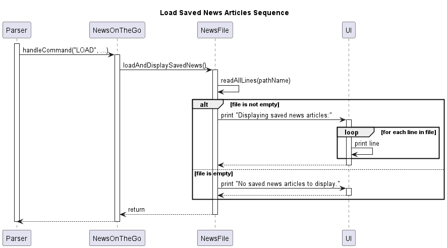

<h4 id="load-design"> Design Considerations </h4>

The design focuses on providing easy access to saved articles, enhancing user experience by allowing them to revisit their saved news without needing to search through past data manually.

#### Alternatives Considered

**Alternative 1 (current choice):** Directly reading from a text file where each line corresponds to an article.

*   **Pros:** Simple to implement and straightforward for users to understand.

*   **Cons:** Limited functionality in terms of sorting or filtering saved articles.


**Alternative 2:** Using a database to store user saved articles, providing enhanced management capabilities.

*   **Pros:** Allows for more complex queries, such as sorting by date, filtering by topic, or even full-text search.

*   **Cons:** Increases complexity of implementation and may require more resources to maintain.

<h3 id="extract"> Extract Feature </h3>

Here is the class diagram for better visualisation:

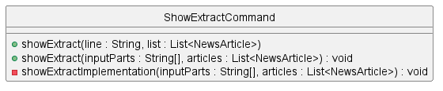

<h4 id="extract-implementation"> Implementation </h4>
This feature provides users with the ability to display the extract of a specific news article from a list. Managed by the **ShowExtractCommand** class, this feature can be used independently or in conjunction with the **DailyNewsCommand** to display article extracts based on the context provided by the user.

1.  When the user inputs the **extract** command along with an article index, **ShowExtractCommand.showExtract(line, list)** or **ShowExtractCommand.showExtract(inputParts, articles)** is called depending on the context.

   2.  If the command is called without prior context set by `DailyNewsCommand`, it defaults to the main list of articles to find the extract. Otherwise, it uses a list that has been set by a previous command, such as `DailyNewsCommand`.

3.  The method `showExtractImplementation()` is then called to process the command and retrieve the content of the specified article.

4.  It wraps the extracted content to fit the terminal width for easy reading, and displays the extract to the user.


Below is a sequence diagram that shows the interaction process initiated by the **extract** command to display an article extract.

#### Design Considerations

The design focuses on providing a user-friendly way to quickly access the summary or extract of news articles, enhancing the reading experience by allowing users to get the gist of articles with a simple command.

#### Alternatives Considered

**Alternative 1 (current choice):** Using a static method with a shared implementation that is called from different contexts depending on whether prior context has been set.

*   **Pros:** Reduces redundancy by reusing the method. It is efficient and maintains consistency across different features that use the extract functionality.

*   **Cons:** Less intuitive for developers new to the codebase, as they have to understand the context in which the shared method is called.


**Alternative 2:** Separate methods for each context without sharing implementation.

*   **Pros:** Can tailor the extract functionality more closely to each feature's specific needs, and it's easier to understand separate methods for separate features.

*   **Cons:** Leads to code duplication, higher maintenance if changes to extract functionality are needed across different features.
### Random Quote Function

The `QuoteGenerator` class is responsible for generating random quotes from a predefined list. 
The class uses a `Random` instance to select a quote at random from the list of quotes.

#### Implementation

1. User: Initiates the `QUOTE` command by providing input.

2. Parser: Creates an instance of QuoteGenerator.

3. Parser: Executes the switch statement for the command, and it encounters the QUOTE case.

4. Parser: Calls the `getRandomQuote()` method on the `QuoteGenerator` instance to get a random quote.

5. QuoteGenerator: Returns a random quote from the quotes list using the generated index.

6. Parser: Receives the random quote from the `QuoteGenerator`.

7. Parser: Uses `UI.printQuote()` to print the received random quote.

8. UI: Prints the quote to the console.

The flow can be seen from the sequence diagram below:


<br>

<h2 id="product-scope"> Appendix A: Product Scope </h2>

<h3 id = "target-user-profile"> Target User Profile </h3>

A typical user ...
- wants to be able to explore a range of articles quickly.
- wants to be able to save news articles that they want to read later on.
- wants personalised suggestions on news articles to read.
- prefers typing to mouse input.
- is reasonably comfortable using CLI apps.

<h3 id = "value-proposition"> Value Proposition</h3>

Allows the exploration of a range of articles from a variety of sources faster than browsing the internet and various 
news sources for articles.

<br>

<h2 id="user-stories"> Appendix B: User Stories </h2>

Priorities: High (must have) - <code>***</code>, Medium (nice to have) - <code>**</code>, Low (not necessary to have) - 
<code>*</code>

| Version | As a ...                            | I want to ...                                                                                     | So that I can ...                                                                                                | Priority          |
|---------|-------------------------------------|---------------------------------------------------------------------------------------------------|------------------------------------------------------------------------------------------------------------------|-------------------|
| v1.0    | busy student                        | to know about the news of the day quickly                                                         | easily find out what is going on a particular day.                                                               | <code>***</code>  |            
| v1.0    | busy student                        | search based on topics easily                                                                     | not look through news that I am not concerned with.                                                              | <code>**</code>   |
| v1.0    | student who cares about credibility | be provided information on the reliability and bias of the news sources                           | judge the trustworthiness of the information and input the correct citations and references in my research paper | <code>*</code>    |
| v1.0    | busy news consumer                  | have the system to keep track of the topics I am interested in when the program is first launched | don't input them every time I am searching for an article of news.                                               | <code>**</code>   |
| v2.0    | non-tech-savvy person               | have more ways to key in the date for the daily function                                          | not have to key in the specific date to use the daily command.                                                   | <code>*</code>    |
| v2.0    | avid reader                         | save the articles that I come across                                                              | read them after saving them to the list.                                                                         | <code>***</code>  |
| v2.0    | non-tech-savvy person               | save articles in the daily function                                                               | save articles that are filtered by date.                                                                         | <code>**</code>   |
| v2.0    | news reader                         | be able to have access to more news articles                                                      | read about more articles to read from.                                                                           | <code>**</code>   |
| v2.0    | reader                              | save the different types of topics                                                                | be suggested about my favourite topics.                                                                          | <code>*</code>    |
| v2.0    | new user                            | see usage instructions                                                                            | refer to instructions when I forget how to use the application.                                                  | <code>***</code>  |
| v2.1    | student                             | get the url of the articles                                                                       | read more about the articles on the website.                                                                     | <code>***</code>  |
| v2.1    | student                             | get the citation of the articles                                                                  | use it when citing my sources.                                                                                   | <code>*</code>    |
| v2.1    | avid reader                         | be recommended more articles                                                                      | read about topics that I do not usually read about.                                                              | <code>**</code>   |
| v2.1    | avid reader of news websites        | read the quote of the day                                                                         | get a daily dose of inspiration                                                                                  | <code>*</code>    |
| v2.1    | busy student                        | access the summary of an article                                                                  | read up on the latest news quickly.                                                                              | <code>**</code>   |

<br>

<h2 id="non-functional-requirements"> Appendix C: Non-Functional Requirements </h2>

1. Should work on any mainstream OS as long as it has Java 11 or above installed.
2. After initialisation, the application should be able to run without significant sluggishness in performance for 
typical usage.
3. Currently, parsing 80+ articles which takes around 1 minute, which should be an optimal amount of time for the user
before it becomes an annoyance.

<br>

<h2 id="glossary"> Appendix D: Glossary </h2>

* *Mainstream OS* - Windows, Linus, Unix, OS-X
* *Article Scraper* - Scraps relevant information of the news article needed for the application based on the url 
provided and stores them into a text file. 
* *News Importer* - Imports news from a text file based on the specified format.

<br>

<h2 id="manual-testing"> Appendix E: Instructions for manual testing </h2>

Do refer to our [User Guide](UserGuide.md) for quick start details.

When running an app, you can key in the command `help` for a list of executable commands and their usage on the 
application. 
> [!NOTE] These instructions only provide a starting point for testers to work on; testers are expected to do more 
> _exploratory_ testing.