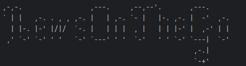
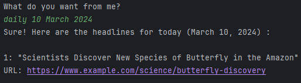
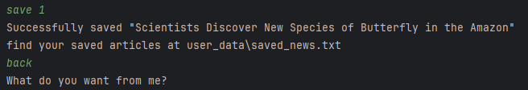
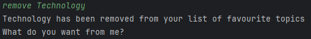
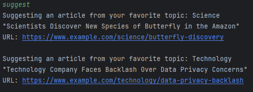
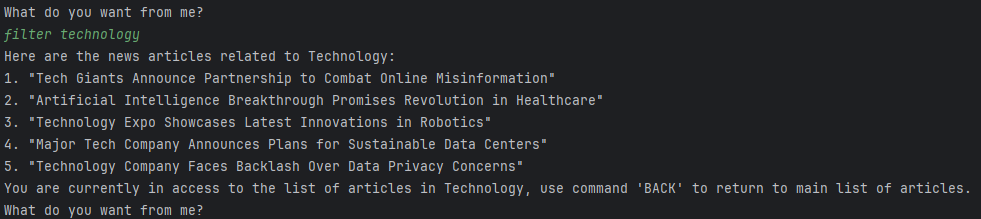
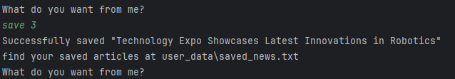
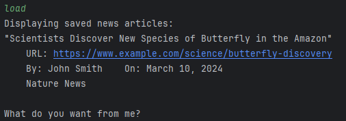
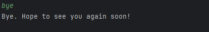

# 

# NewsOnTheGo User Guide

NewsOnTheGo is a command-line application (CLI) that helps users stay up-to-date with the latest news articles by 
providing users with a list of the current headlines. 

Users are able to personalise this application by saving their
preferred topics and articles.

There are other features, as described below, that further enhance the user experience and convenience
of this application.

This guide will help you get started with using NewsOnTheGo and understand its features.

## Quick Start

1. Ensure you have Java `11` or above installed in your Computer.
2. Download the latest version of `NewsOnTheGo.jar` from the releases page.
3. Copy the file to the folder you want to use as the home folder for your NewsOnTheGo.
4. Open your command-line interface and navigate to the folder where you placed the jar file.
5. Run the command `java -jar NewsOnTheGo.jar` to start the application.
6. Type the command in the command box and press Enter to execute it.
7. Refer to the Features section below for details of each command.

## Features

### Getting Help: `help`
Shows all the commands available and their brief description.

#### Format: `help`

### Find articles on a particular day: `daily`
Gets the list of articles from our text file and outputs it to the user.

#### Format: `daily {DATE}`

* The `DATE` format: `MM dd yyyy`/`MMMM dd yyyy`/`dd MMMM yyyy`

#### Example of usage:

* `daily 03 10 2024`

* `daily March 10 2024`

* `daily 10 March 2024`

  
After using the `daily` command, you can use `save` or `back` or `quit`.

### Save articles from the daily function: `save`

#### Format: `save {INDEX OF ARTICLE}`  
This allows the user to save the news articles displayed by the `daily` function.  

#### Example of usage:
`save 1`.  

### Command to quit the daily function parser: `back` | `quit`

#### Format: `back` | `quit`
Use either command to exit the daily function after done saving their desired articles.  

#### Example of usage: `back`  

  

### Star a topic: `star`

Stars a topic to add it to your list of favorite topics.

#### Format: `star {TOPIC}`

- Star a topic to receive suggestions based on it.

#### Example of usage:
- `star Science`  
- `star Sports`

### Remove a topic: `remove`

Removes a topic from your list of favorite topics.

#### Format: `remove {TOPIC}`

#### Example of usage:
- `remove Science`
- `remove Sports`

### Suggesting articles: `suggest`

Suggests articles from your favorite topics.

#### Format: `suggest`  

#### Example of usage:  
 Assuming we have Science and Technology as our favourite topics.

  

### Searching for articles on a particular topic: `filter`
Find articles based on the topic input from the user.

#### Format: `filter {TOPIC}`

#### Example of usage:
- `filter Science`
- `filter Sports`

### Saving articles from the filter command: `save`

Saves the article title from the `filter` command into a text file.  

<strong>
Note: Do not be confused with the other <code>save</code> function in <code>daily</code>.
</strong>

#### Format: `save {INDEX OF ARTICLE}`

#### Example of usage: 
- `save 1`
- `save 5`  

Assuming we have the used `filter technology` from before.  

### Loading saved news: `load`
Displays all saved news articles from the saved articles text file.

#### Format: `load`

### Get source of article: `source`
Displays the source of the article.

Format: `source {index of article on displayed list}`

### Returning to the previous menu or list: `back`
Returns from a filtered list of news or the saved news window to the main list of articles.

#### Format: `back`

* Only applicable if you have filtered the list of news using the `filter` command or used the `save` command to save an article.

### Exiting the program: `bye`

Exits the application.

#### Format: `bye`

## Known Issues
1. When keying in floating point values for the date in `daily` function, the parser is unable to parse in the daily 
function. Take note by keying in integers only. Make sure the integer do not exceed the size of an integer too.

## Command Summary

| Commands    | Format, Examples                       |
|-------------|----------------------------------------|
| **HELP**    | `help`                                 |
| **DAILY**   | `daily March 10 2024`                  |
| **STAR**    | `star Technology`                      |
| **REMOVE**  | `remove Technology`                    |
| **SUGGEST** | `suggest`                              |
| **SAVE**    | `save 1`                               |
| **LOAD**    | `load`                                 |
| **BACK**    | `back`                                 |
| **BYE**     | `bye`                                  |