# NewsOnTheGo User Guide

NewsOnTheGo is a command-line application (CLI) that helps users stay up-to-date with the latest news articles by 
providing users with a list of up-to-date articles. 

Users are able to personalise this application by saving their
preferred topics and articles.

There are other features, as described below, that further enhance the user experience and convenience
of this application.

This guide will help you get started with using NewsOnTheGo and understand its features.

# Table of Content

<ol type="1" style="font-size: large">
    <li><a href="#quick-start" >Quick Start</a></li>
    <li><a href="#features">Features</a>
        <ol type="1" style="font-size: medium">
            <li><a href="#help">Getting Help: <code>help</code></a></li>
            <li><a href="#daily">Finding Articles on a Particular Day: <code>daily</code></a></li>
            <li><a href="#topics">List out Article Topics: <code>topics</code></a></li>
            <li><a href="#star">Starring a Topic: <code>star</code></a></li>
            <li><a href="#starred">Checking Starred Topics: <code>starred</code></a></li>
            <li><a href="#remove">Removing a Starred Topic: <code>remove</code></a></li>
            <li><a href="#suggest">Getting News Suggestions: <code>suggest</code></a></li>
            <li><a href="#filter">Filtering Articles by Topic: <code>filter</code></a></li>
            <li><a href="#save">Save Articles to Reading List: <code>save</code></a></li>
            <li><a href="#source">Getting Article Source: <code>source</code></a></li>
            <li><a href="#back">Returning to Main: <code>back</code></a></li>
            <li><a href="#url">Getting Article Link: <code>url</code></a></li>
            <li><a href="#headlines">Viewing Article Headlines: <code>headlines</code></a></li>
            <li><a href="#extract">Viewing Article Extract: <code>extract</code></a></li>
            <li><a href="#get">Getting Article Details: <code>get</code></a></li>
            <li><a href="#load">Loading Saved Articles: <code>load</code></a></li>
            <li><a href="#clear">Clearing Saved Articles: <code>clear</code></a></li>
            <li><a href="#quote">Getting Inspirational Quote: <code>clear</code></a></li>
            <li><a href="#bye">Exiting the Program: <code>bye</code></a></li>
        </ol>
    </li>
    <li><a href="#known-issues">Known Issues</a></li>
    <li><a href="#command-summary">Summary of Commands</a></li>
</ol>

<h2 id="quick-start"> Quick Start </h2>

1. Ensure you have Java `11` or above installed in your Computer.
2. Download the latest version of `newsonthego.jar` from [the release page](https://github.com/AY2324S2-CS2113-T12-1/tp/releases/tag/v2.0).
3. Copy the file to the folder you want to use as the home folder for NewsOnTheGo.
4. Open a command terminal, `cd` into the folder where you put the jar file in.
5. Run the command `java -jar newsonthego.jar` to start the application.
6. If you are running the application for the first time, please wait for some time as 
our Article Scraper is hard at work.
6. Type in your name to initialise the system.
7. Type the command in the command box and press Enter to execute it.
8. Refer to the [Features](#Features) section below for details of each command.

<h2 id="features"> Features </h2>

> [!NOTE]
> 
> When using the `daily` function, choose a date from late March to early April 2024, as that is when most of the 
> articles are from.
> 
> Regarding the command format:
> 
> - Words in `{Curly Braces}` are parameters to be supplied by the user.
> 
>   e.g. in `filter {TOPIC}`, `TOPIC` is a parameter which can be used as `filter sports`.
>   - more information on the format of input parameters can be found under each specific command
> - Extraneous parameters for commands that do not take in parameters (such as `help`, `topics`, `bye`) will be ignored.
>   
>   e.g. if the command specifies `help 123`, it will be interpreted as `help`.

 

<h3 id="help"> Getting Help: <code>help</code> </h3>
Shows all the commands available and their brief description.

Format: `help`

What do you want from me?
____________________________________________________________

help
____________________________________________________________

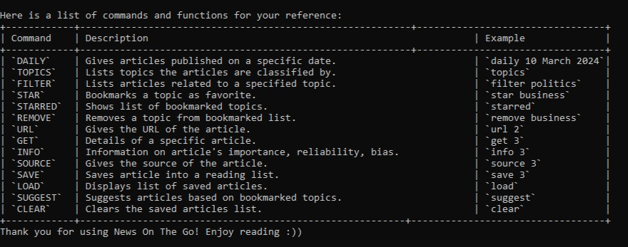

<h3 id="daily"> Find articles on a particular day: <code>daily</code> </h3>
Gets the list of articles from our text file and outputs it to the user.

 

Format: `daily {DATE}`

> [!IMPORTANT]
> `DATE` format should be as follows:
> - `MM dd yyyy`
> - `MMMM dd yyyy`
> - `dd MMMM yyyy`
> 
> The specified month is not case-sensitive, e.g. `March` and `march` will both be read the same given 
> the input date is valid.

#### Example of usage:

* `daily 07 04 2024`

* `daily April 07 2024`

* `daily 07 April 2024`

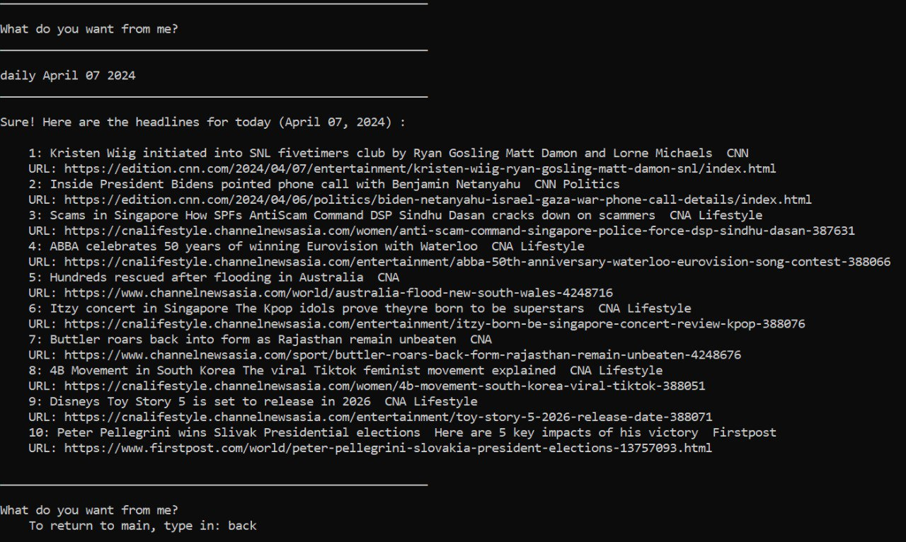

 

> [!NOTE] After using the `daily` command, you can use <a href = "#save">`save`</a> and <a href = "#back">`back`</a> commands.
>
> User should receive a message like this:
> 
>  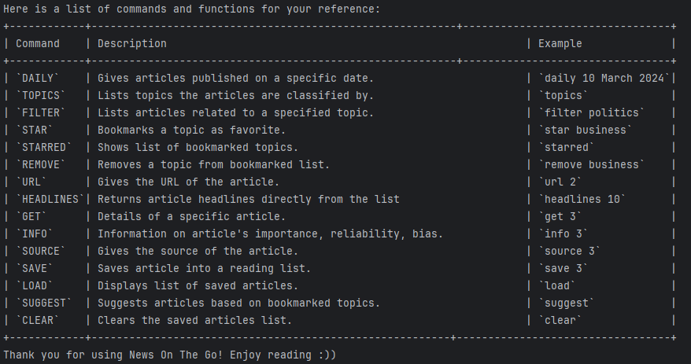
> 

 

<h3 id="topics"> Listing Out Article Topics: <code>topics</code> </h3>

List the different topics our articles are classified into.

Format: `topics`

#### Example of usage:

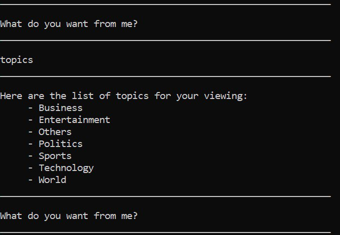

 

<h3 id="star"> Starring a Topic: <code>star</code> </h3>

Adds a topic to your list of favorite topics.

Format: `star {TOPIC}`

#### Example of usage:
- `star Science`  
- `star Sports`

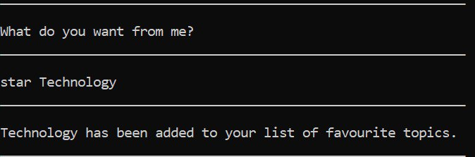

 

<h3 id="starred"> Checking Starred Topics: <code>starred</code> </h3>

List the different topics our articles are classified into.

Format: `starred`

#### Example of usage:

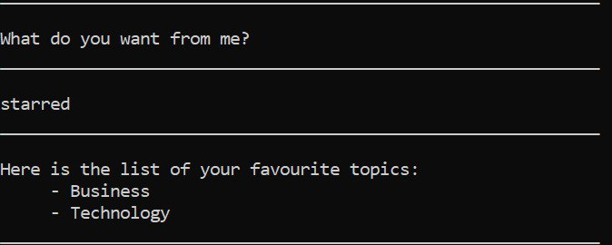

 

<h3 id="remove"> Removing a Starred Topic: <code>remove</code> </h3>

Removes a topic from your list of favorite topics.

Format: `remove {TOPIC}`

#### Example of usage:
- `remove Science`
- `remove Sports`

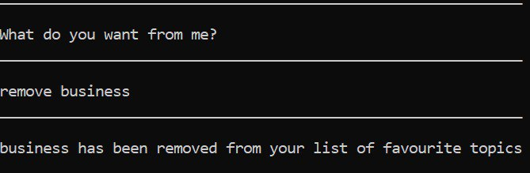

 

<h3 id="suggest"> Getting Article Suggestions: <code>suggest</code> </h3>

Suggests articles from your favorite topics.

Format: `suggest`  

#### Example of usage:  
 Assuming we have Technology and Business as our favourite topics.

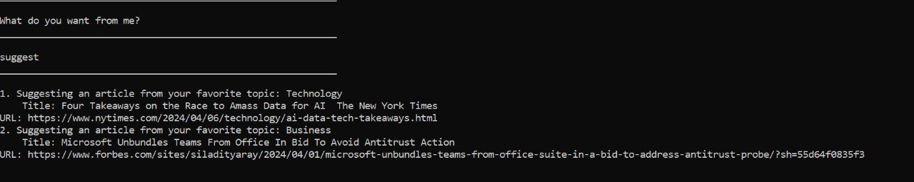

 

<h3 id="filter"> Filtering Articles by Topic: <code>filter</code> </h3>
Find articles based on the topic input from the user.

Format: `filter {TOPIC}`

#### Example of usage:
- `filter Science`
- `filter Sports`

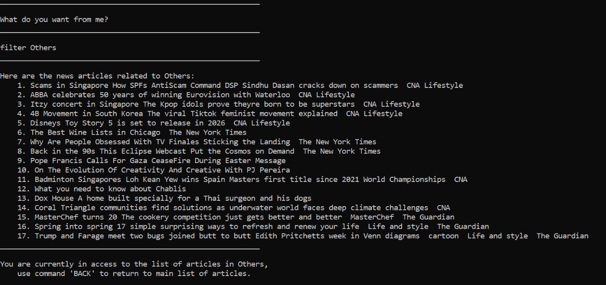

 

>[!NOTE] 
> After using the `filter` command, you are able to use the <a href = "#save">`save`</a>, 
> <a href = "#sourcce">`source`</a>, <a href = "#url">`url`</a>, <a href = "#extract">`extract`</a>, 
> <a href = "#get">`get`</a> commands on
> the filtered list of articles.
> 
> Use `back` command to return to main list of articles.

 

<h3 id="save"> Saving Articles to Reading List: <code>save</code> </h3>

Saves the article title into a text file.

> [!NOTE] 
> `save` function can be used in `daily`, `filter`, or in the main.  

Format: `save {INDEX OF ARTICLE ON DISPLAYED LIST}`

#### Example of usage: 
- `save 1`
  - saves the first item in the current article list
- `save 5`  
  - saves the fifth item in the current article list

Assuming we have the used `filter Others` from before.

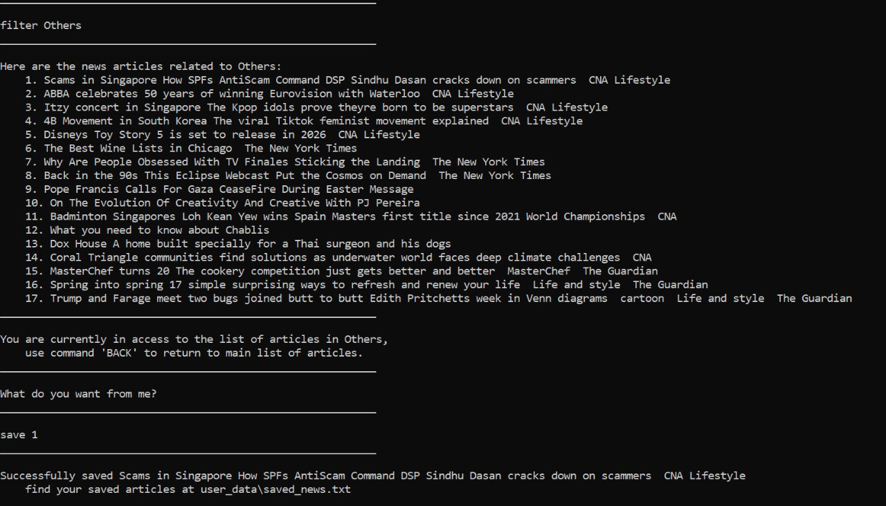

 

<h3 id="source"> Getting Article Source: <code>source</code> </h3>
Displays the source of the article and its APA citation.

#### Format: `source {INDEX OF ARTICLE ON DISPLAYED LIST}`

### Example of usage:
- `source 1`
- `source 5`

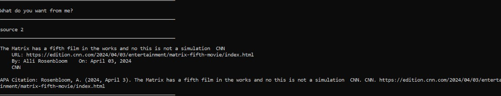

 

<h3 id="back"> Returning to Main: <code>back</code> </h3>
Returns from a filtered list of news or the saved news window to the main list of articles.

#### Format: `back`

* Only applicable if you have filtered the list of news using the `filter` or `daily` command.

#### Example of usage:
Assuming we are currently in the list of articles under the topic Others:

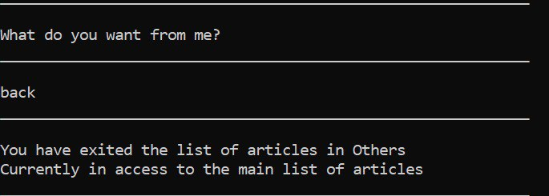

Or, assuming we have just executed the `daily` command and is currently in the daily loop.

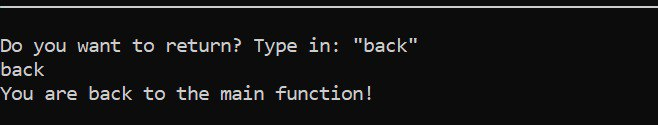

 

<h3 id="url"> Getting Article Link: <code>url</code> </h3>

Retrieves the URL of a specific article.

Format: `url {INDEX OF ARTICLE}`

#### Example of usage:
- `url 1`
- `url 2`

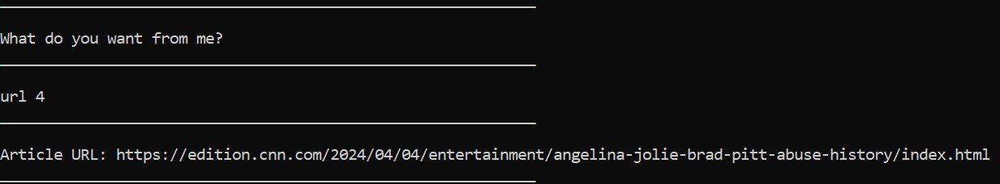

 

<h3 id="headlines"> Viewing Article Headline: <code>headlines</code> </h3>

Retrieves the headlines of articles from the list of articles until the index specified by the user.

Format: `headlines {INDEX OF ARTICLE}`

#### Example of usage:
- `headlines 2`
- `headlines 10`

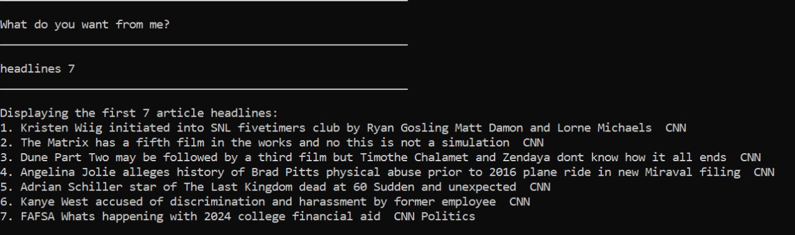

 

<h3 id="extract"> Viewing Article Extract: <code>extract</code> </h3>

Retrieves and displays the summary or extract of a specific article from the list of articles.

Format: `extract {INDEX OF ARTICLE}`

#### Example of usage:
- `extract 3`
- `extract 5`

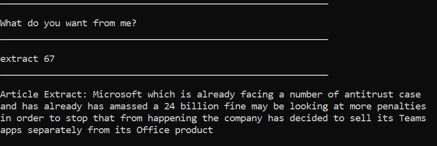

 

<h3 id="get"> Getting Article Details: <code>get</code> </h3>

Retrieves the details of a specific article.

Format: `get {INDEX OF ARTICLE}`

#### Example of usage:
- `get 3`
- `get 5`

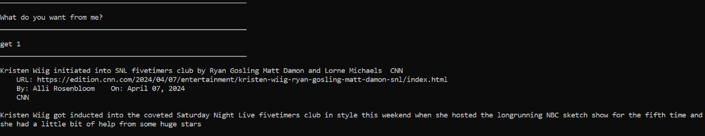

 

<h3 id="load"> Loading Saved Articles: <code>load</code> </h3>
Displays all saved news articles from the saved articles text file.

Format: `load`  

#### Example of usage:

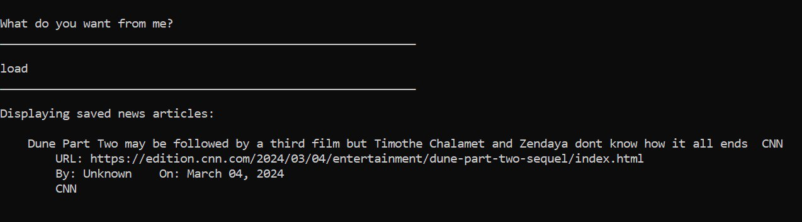

 

<h3 id="clear"> Clear Saved Articles: <code>clear</code> </h3>

Clears the list of articles saved.

Format: `clear`

#### Example of usage:

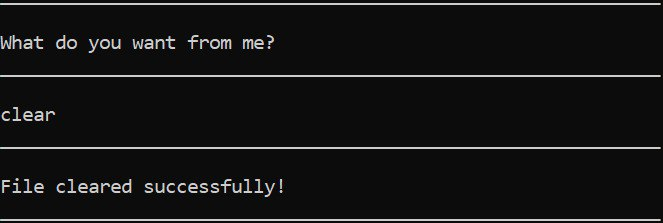

 

<h3 id="quote"> Getting Inspirational Quote: <code>quote</code> </h3>

Prints a random inspirational quote each time the command is called

Format: `quote`

#### Example of usage:

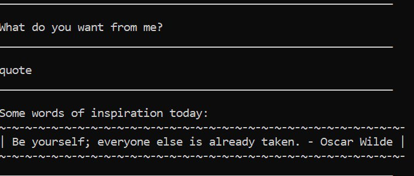

 

<h3 id="bye"> Exiting the Program: <code>bye</code> </h3>

Exits the application.

Format: `bye`

#### Example of usage:

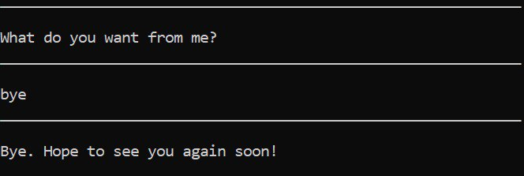

 

<h2 id="known-issues"> Known Issues </h2>
1. When keying in floating point values for the date in `daily` function, the parser is unable to parse in the daily 
function. Take note by keying in integers only. Make sure the integer do not exceed the size of an integer too.

 

<h2 id="command-summary"> Summary of Commands </h2>

| Commands      | Format, Examples                            |
|---------------|---------------------------------------------|
| **HELP**      | `help`                                      |
| **DAILY**     | `daily {DATE}` eg.`daily April 10 2024` |
| **TOPICS**    | `topics`                                    |
| **STAR**      | `star {TOPIC}` eg.`star Technology`     |
| **STARRED**   | `starred`                                   |
| **REMOVE**    | `remove {TOPIC}` eg.`remove Technology` |
| **SUGGEST**   | `suggest`                                   |
| **FILTER**    | `filter {TOPIC}` eg.`filter health`     |
| **SAVE**      | `save {INDEX}` eg.`save 1`              |
| **SOURCE**    | `source {INDEX}` eg.`source 1`          |
| **BACK**      | `back`                                      |
| **URL**       | `url {INDEX}` eg.`url 2`                |
| **HEADLINES** | `headlines {INDEX}` eg.`headlines 10`   |
| **EXTRACT**   | `Extract {INDEX}` eg.`extract 10`       |
| **GET**       | `get {INDEX}` eg.`get 3`                |
| **LOAD**      | `load`                                      |
| **CLEAR**     | `clear`                                     |
| **QUOTE**     | `quote`                                     |
| **BYE**       | `bye`                                       |
