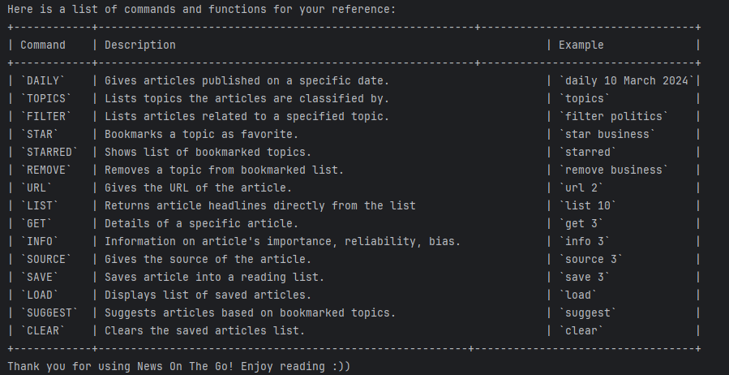

 #  NewsOnTheGo User Guide

NewsOnTheGo is a command-line application (CLI) that helps users stay up-to-date with the latest news articles by 
providing users with a list of the current headlines. 

Users are able to personalise this application by saving their
preferred topics and articles.

There are other features, as described below, that further enhance the user experience and convenience
of this application

This guide will help you get started with using NewsOnTheGo and understand its features.

## Quick Start

1. Ensure you have Java `11` or above installed in your Computer.
2. Download the latest version of `NewsOnTheGo.jar` from the releases page.
3. Copy the file to the folder you want to use as the home folder for your NewsOnTheGo.
4. Open your command-line interface and navigate to the folder where you placed the jar file.
5. Run the command `java -jar NewsOnTheGo.jar` to start the application.
6. Type the command in the command box and press Enter to execute it.
7. Refer to the Features section below for details of each command.

## Features

### Star a topic: `star`

Stars a topic to add it to your list of favorite topics.

Format: `star TOPIC`

- Star a topic to receive suggestions based on it.

Example:
`star Technology`

### Remove a topic: `remove`

Removes a topic from your list of favorite topics.

Format: `remove TOPIC`

Example:
`remove  Technology`

### Suggesting articles: `suggest`

Suggests articles from your favorite topics.

Format: `suggest`

### Saving : `save`

Saves an article title into a text file.

Format: `save {index of article on displayed list}`

Example: 
'save 1'

### Exiting the program: `bye`

Exits the application.

Format: `bye`

## Command Summary

| Commands    | Format, Examples                       |
|-------------|----------------------------------------|
| **DAILY**   | `daily March 10 2024`                  |
| **SAVE**    | `save 1`                               |
| **STAR**    | `star TOPIC`   e.g., `star Science` |
| **REMOVE**  | `remove INDEX`   e.g., `remove 3`   |
| **SUGGEST** | `suggest`                              |
| **SAVE**    | `save 1`                               |
| **BYE**     | `bye`                                  |
