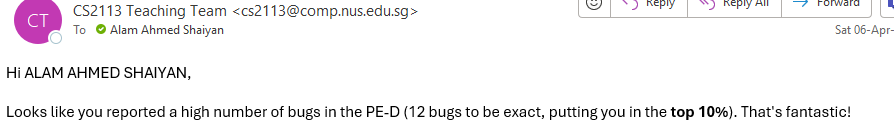

# Alam Ahmed Shaiyan - Project Portfolio Page

## Overview

NewsOnTheGo is a command line interface (CLI) application that helps users stay up-to-date with the latest news
articles by providing users with a list of the current headlines. Users are able to personalise this application by
saving their preferred topics and articles.

## Summary of Contributions
### Code Contributed: [RepoSense Link](https://nus-cs2113-ay2324s2.github.io/tp-dashboard/?search=ahmedshaiyan&breakdown=true)

### Enhancements Implemented:
1.  **Added the ability to be suggested articles based on favorite topics** [#61](https://github.com/AY2324S2-CS2113-T12-1/tp/pull/61)
    - **What it does:** Offers article recommendations based on the user's favorite topics.
    - **Justification:** This feature enhances user engagement by providing personalized article suggestions.
    - **Highlights:** This feature involved complex logic to filter articles according to user's starred topics display them at random.

2. **Added the ability to quickly view article headlines** [#127](https://github.com/AY2324S2-CS2113-T12-1/tp/pull/127)
    - **What it does:** Displays a specified number of article headlines from the news list.
    - **Justification:** Allows users to quickly browse headlines without loading full articles, improving the user experience in terms of speed and convenience.

3. **Added the ability to load and display saved news articles** [#55](https://github.com/AY2324S2-CS2113-T12-1/tp/pull/55) [#115](https://github.com/AY2324S2-CS2113-T12-1/tp/pull/115)
    - **What it does:** Loads and displays saved articles from a user's reading list.
    - **Justification:** Enables users to easily access their saved articles, enhancing the application's usability.
    - **Highlights:** Involved file handling and user interface updates to ensure a seamless reading list management experience.

4. **Added the ability to get the URL of articles** [#112](https://github.com/AY2324S2-CS2113-T12-1/tp/pull/112)
    - **What it does:** Provides direct URLs to full news articles.
    - **Justification:** This feature is essential for users who wish to read the complete article, thereby extending the functionality of the news application to serve as a starting point for deeper exploration.
    - **Highlights:** Required integration with the web scraping module to retrieve and manage live URLs.
5. **Added the ability to access the summary of an article** [#162](https://github.com/AY2324S2-CS2113-T12-1/tp/pull/162)
    - **What it does:** Displays the summary or content of the selected news article.
    - **Justification:** This feature enriches user interaction by allowing them to read summaries quickly and decide if they want to explore the full article.
    - **Highlights:** The challenge was to present the content neatly formatted, which involved designing a responsive text wrapping system in the CLI so that the text prints in a newline after a certain length.

### Documentation
**User Guide:**  [#61](https://github.com/AY2324S2-CS2113-T12-1/tp/pull/61) [#66](https://github.com/AY2324S2-CS2113-T12-1/tp/pull/66)
  Added  documentation for the `Suggest`, `Load`,`URL`, `Headline`,`Extract` features 

**Developer guide:** [#48](https://github.com/AY2324S2-CS2113-T12-1/tp/pull/48) [#53](https://github.com/AY2324S2-CS2113-T12-1/tp/pull/53) [#65](https://github.com/AY2324S2-CS2113-T12-1/tp/pull/65) [#155](https://github.com/AY2324S2-CS2113-T12-1/tp/pull/155) [#157](https://github.com/AY2324S2-CS2113-T12-1/tp/pull/157) [#163](https://github.com/AY2324S2-CS2113-T12-1/tp/pull/163)
  Added documentation and diagrams for the implementation and details about the design considerations for the `Suggest`, `Load`,`URL`, `Headline`,`Extract` features
  Added Design documentation for all components
  Added user stories for my features

### Enhancements to existing features
1. Added extract feature to `DailyNewsCommand` [#162](https://github.com/AY2324S2-CS2113-T12-1/tp/pull/162)
2. Formatted the help method for better visualisation [#123](https://github.com/AY2324S2-CS2113-T12-1/tp/pull/123)
3. Added logging to all method in the `NewsOnTheGo` class [#148](https://github.com/AY2324S2-CS2113-T12-1/tp/pull/148)
4. Wrote Junit tests for `Suggest` , `headlines`, `url`, `load` and `extract` features [#138](https://github.com/AY2324S2-CS2113-T12-1/tp/pull/138), [#162](https://github.com/AY2324S2-CS2113-T12-1/tp/pull/162)

### Community 
1. PRs reviewed: [24](https://github.com/AY2324S2-CS2113-T12-1/tp/pulls?q=is%3Apr+is%3Aclosed+reviewed-by%3A%40me)
2. Provided support to other teammates for ideation of features and bug-fixing
3. Reported 12 bugs for another team during PE-D [CS2113-W12-2](https://github.com/AY2324S2-CS2113-W12-2/tp/releases)

