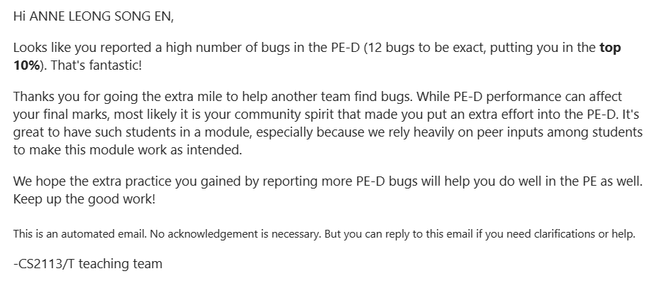

# Anne Leong - Project Portfolio Page
# News On The Go
## Overview
NewsOnTheGo is a command-line application (CLI) that helps users stay up-to-date with the latest news articles by
providing users with a list of up-to-date articles. It is written in java, and has about 1kLoC.

Refer to code contributed [here](https://nus-cs2113-ay2324s2.github.io/tp-dashboard/?search=anneleong&breakdown=true)

### Contributions to Documentation
- About Us
  - Added in hyperlinks to teammates' github accounts and Project Portfolio Page.
- User Guide
  - Edit and ensure consistent formatting of the user guide.
- Developers' Guide
  - Added Implementation Details for Topic and Filter Feature.
  - Added sequence Diagrams to supplement explanations under Topic and Filter Feature.

### Contributions to Team-Based Tasks
- Created OOP classes `NewsTopic` and `NewsArticle` to be used in the code by teammates.
- Helped to ensure UI is consistent amongst various functions implemented.

### Reviews/Mentoring Contributions
- Pull Request Reviews
  
  Reviewed/Merged PR [#18](https://github.com/AY2324S2-CS2113-T12-1/tp/pull/18),
PR [#20](https://github.com/AY2324S2-CS2113-T12-1/tp/pull/20),
PR [#37](https://github.com/AY2324S2-CS2113-T12-1/tp/pull/37),
PR [#56](https://github.com/AY2324S2-CS2113-T12-1/tp/pull/56),
PR [#61](https://github.com/AY2324S2-CS2113-T12-1/tp/pull/61),
PR [#124](https://github.com/AY2324S2-CS2113-T12-1/tp/pull/124),
PR [#125](https://github.com/AY2324S2-CS2113-T12-1/tp/pull/125),
PR [#128](https://github.com/AY2324S2-CS2113-T12-1/tp/pull/128),
PR [#132](https://github.com/AY2324S2-CS2113-T12-1/tp/pull/132)

### Contributions beyond Project Team

- Contributions to Forum
  - Sought help from fellow tutors and peers when I was unable to solve the issue after deliberation with my teammates 
  and gave my resolution after in [forum issue #38](https://github.com/nus-cs2113-AY2324S2/forum/issues/38).

- Bugs caught
  - I tried to test the [product assigned to me](https://github.com/AY2324S2-CS2113-F15-2/tp) as thoroughly as possible 
  and was able to catch a significant number of bugs. Yay!
  
  - Issues opened: [#116](https://github.com/AY2324S2-CS2113-F15-2/tp/issues/116), 
  [#118](https://github.com/AY2324S2-CS2113-F15-2/tp/issues/118), 
  [#121](https://github.com/AY2324S2-CS2113-F15-2/tp/issues/121),
  [#122](https://github.com/AY2324S2-CS2113-F15-2/tp/issues/122),
  [#125](https://github.com/AY2324S2-CS2113-F15-2/tp/issues/125),
  [#127](https://github.com/AY2324S2-CS2113-F15-2/tp/issues/127),
  [#132](https://github.com/AY2324S2-CS2113-F15-2/tp/issues/132),
  [#136](https://github.com/AY2324S2-CS2113-F15-2/tp/issues/136),
  [#137](https://github.com/AY2324S2-CS2113-F15-2/tp/issues/137),
  [#140](https://github.com/AY2324S2-CS2113-F15-2/tp/issues/140),
  [#143](https://github.com/AY2324S2-CS2113-F15-2/tp/issues/143),
  [#145](https://github.com/AY2324S2-CS2113-F15-2/tp/issues/145),

### Summary of Contributions
#### `topics` function
- What it does: Allows the user to view the current list of article topics.
- Justification: This feature allows the user to conveniently see the list of topics available for reading, 
complementing the `filter` function.
#### `filter` command
- What it does: Allows the user to see a list of Articles from the same topic only.
- Highlights: Other commands can be used in conjunction with the filter function (**Credits** to complementary functions
created by team members)
#### `save` command
- What it does: Allows the user to save certain articles for reading later on.
- Justification: This feature allows user to obtain a reading list of articles that they will be able to read in their 
free time, even after the program completes its execution.
#### `star [topic]` command
- What it does: Allows the user to save certain Topics which they may be interested in.
- Justification: This function complements the `suggest` function created by [Shaiyan](AhmedShaiyan.md) which makes use 
of the list of saved topics to suggest articles which the user might share interest in.
- Highlights: `starred` and `remove [topic]` are functions created as an extension of the `star` command that allows it 
to function more cohesively.